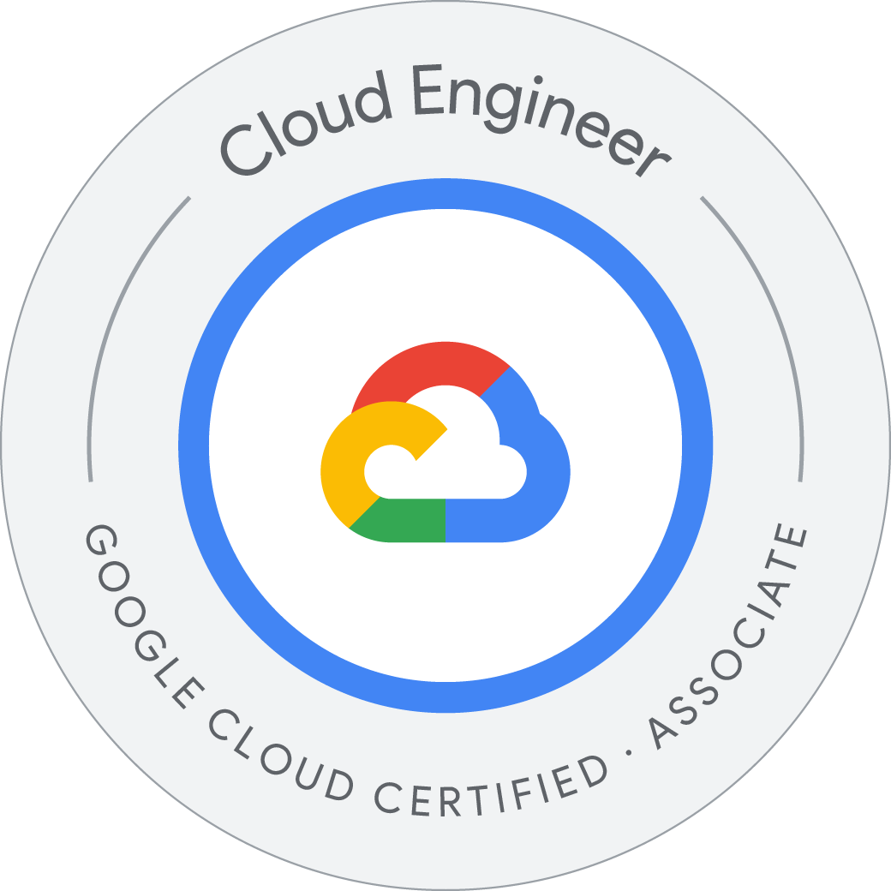

  <h1>Hi there, I'm Himanshu 👋</h1>
  <h3>Senior Product & Platforms Engineer | Distributed Systems & Cloud Architecture</h3>
  
Architecting high-scale, multi-tenant cloud platforms and exploring AI-driven autonomous systems.

 

### 🚀 About Me

- 🌍 Based in **Berlin, Germany** (Originally from Guwahati, India).
- 🏢 Currently driving the technical roadmap for cloud-native platforms at **dunnhumby**.
- 🔭 **Actively building:**
  - 🎯 **Sniper:** An autonomous algorithmic trading model targeting Nifty 50 equities with custom multi-layered execution logic.
  - 🍟 **[airfryerconverter.app](https://airfryerconverter.app/):** A mobile-first, web-based kitchen utility tool.
- ⚙️ **Focus Areas:** System reliability, cross-functional team leadership, observability, and driving CI/CD maturity.
- 🧠 **AI Explorer:** Heavy user of AI development workflows leveraging Ollama, Aider, Claude, and Gemini for rapid prototyping and local training.
- 📫 **Let's connect:** [LinkedIn](https://www.linkedin.com/in/himanshu-s) | [Email](mailto:singhhimanshu2408@gmail.com)

---

### 💻 Tech Stack & Tools

  
  
  
  
  
  
  
  

 

---

### 🏆 Certifications

  

**☁️ Cloud Architecture & DevOps**
- Getting Started with Terraform for Google Cloud *(Google)*
- Elastic Google Cloud Infrastructure: Scaling and Automation *(Google)*
- Getting Started with Google Kubernetes Engine *(Google)*
- Develop Your Google Cloud Network Skill Badge *(Google)*

**💻 Software Engineering & Backend**
- RESTful Web API - The Complete Guide (.NET 7 API) *(Udemy)*
- C# Advanced Topics: Prepare for Technical Interviews *(Udemy)*
- Testing React with Jest and React Testing Library *(Udemy)*

**🧠 AI & Leadership**
- Introduction to Generative AI *(Google)*
- Scrum Master + Agile Scrum Training *(Udemy)*

---

### 📊 GitHub Stats

  

